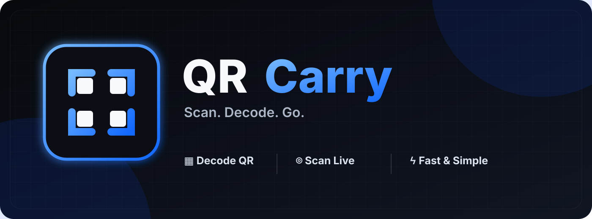

# QR Carry



A clean, mobile-first QR decoder and scanner that runs as a Node.js Web Service.

QR Carry decodes QR images locally in the browser when possible, with a server fallback for difficult images. It also supports live camera scanning and app-aware link handling for QR codes such as Roblox deep links.

## Features

- Decode QR codes from PNG, JPG, JPEG, WebP, HEIC and HEIF images
- Multiple decoding fallbacks for difficult images
- Live camera QR scanner
- Copy decoded QR content with one tap
- Open decoded URLs and supported app/deep links
- Mobile-first dark interface
- Server-side fallback for images Safari cannot decode locally
- No database required
- No user account required
- Designed to run on Render as a Node.js Web Service

## Deploy on Render

The easiest way to deploy QR Carry is with Render.

### 1. Fork or use this repository

Create your own fork of this repository on GitHub, or connect the repository directly to Render.

### 2. Create a Web Service

In Render, choose **New + → Web Service** and select your GitHub repository.

Use these settings:

| Setting | Value |
| --- | --- |
| Runtime | Node |
| Build Command | `npm install` |
| Start Command | `npm start` |

No database or environment variables are required for the basic deployment.

### 3. Deploy

Click **Create Web Service**. Render installs the dependencies and starts the app automatically.

The server listens on Render's `$PORT` and binds to `0.0.0.0`, so no extra port configuration is needed.

A health endpoint is available at:

```text
/health
```

## Deploy with render.yaml

This repository includes a `render.yaml` Blueprint configuration. If you use Render Blueprints, connect the repository and let Render create the service from the configuration.

## Run locally

Requirements:

- Node.js 18+
- npm

Install dependencies:

```bash
npm install
```

Start the server:

```bash
npm start
```

Then open:

```text
http://localhost:3000
```

For development, you can also use:

```bash
npm run dev
```

## How it works

QR Carry first tries to decode an image directly in the browser. This keeps normal decoding fast and avoids uploading an image unnecessarily.

If local decoding cannot read the image, the Web Service can process the image server-side and return the decoded QR payload. Uploaded images are processed for decoding and are not intentionally stored by the application.

The camera scanner uses the device camera through the browser's media APIs. Camera access requires HTTPS or localhost and requires the user to grant permission.

## App links

QR codes can contain normal web URLs, phone links, email links, or application-specific deep links. QR Carry preserves the decoded payload and provides an **Open link** action when the payload can be opened as a URI.

Whether an app actually opens is ultimately controlled by the operating system and the app's Universal Link/deep-link configuration. QR Carry cannot force iOS or Android to open an app that has not registered the corresponding link.

## Project structure

```text
qrcarry/
├── index.html
├── style.css
├── script.js
├── server.js
├── package.json
├── render.yaml
├── assets/
│   └── qrcarry-banner.svg
└── README.md
```

## Security notes

The server fallback accepts image uploads only for QR decoding and limits upload size. Keep the Web Service dependencies updated when deploying your own instance.

QR Carry is intended as a lightweight utility and does not provide authentication, persistent storage, or a database.

## License

See the repository for the current project license.
